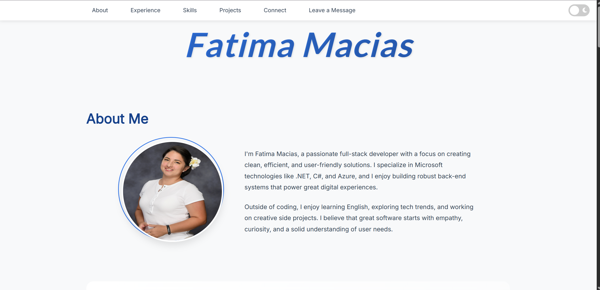
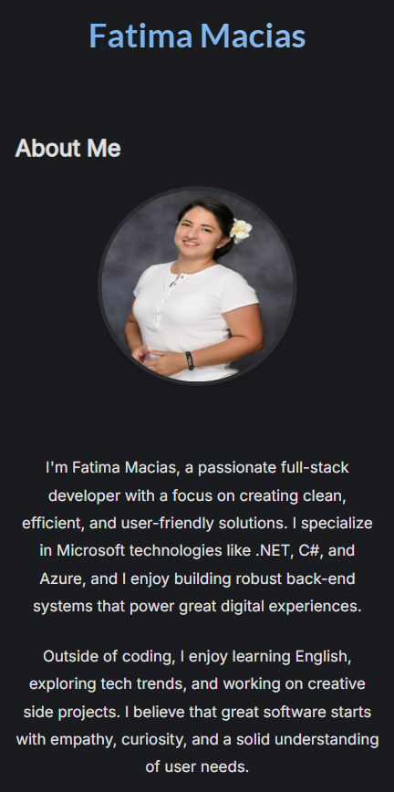

# Fatima Macias – Portfolio

Welcome to my personal portfolio!  
This site showcases my experience, skills, and projects as a Full-Stack Developer, with a focus on Microsoft technologies, modern web development, and cloud solutions.

---

## 🚀 About Me

Hi! I'm **Fatima Macias**, a passionate full-stack developer with experience in .NET, C#, Azure, SQL Server, and modern JavaScript frameworks.  
I love building robust, scalable, and user-friendly applications, and I'm always learning new technologies to improve my craft.

---

## 🌟 Features

- **Responsive Design:** Looks great on desktop, tablet, and mobile.
- **Dark/Light Mode:** Switch themes for comfortable viewing.
- **Experience Section:** My professional journey and key responsibilities.
- **Skills Section:** Technologies and tools I use, dynamically rendered from JavaScript.
- **Projects Section:** My GitHub repositories, with live data and details.
- **Contact/Connect:** Easy ways to reach me via email or social media.
- **Leave a Message:** Interactive form to send me a message (with edit/delete options).

---

## 🛠️ Technologies Used

- **HTML5 & CSS3** (with Flexbox & Grid)
- **JavaScript (ES6+)**
- **Font Awesome** (icons)
- **Google Fonts: Inter, Pacifico**
- **GitHub API** (for projects section)

---

## 📂 Project Structure

```
/
├── css/
│   └── index.css
├── js/
│   └── index.js
├── img/
│   └── me.jpg
├── index.html
└── README.md
```

---

## 📸 Screenshots




---

## 📝 How to Use

1. **Clone this repo:**
   ```bash
   git clone https://github.com/fatimacias/fatima-macias-kepler.git
   ```
2. **Open `index.html` in your browser.**
3. **Explore the sections, try the message form, and check out my projects!**

---

## 📬 Contact

- **Email:** [fatima.macias.us@gmail.com](mailto:fatima.macias.us@gmail.com)
- **LinkedIn:** [Fatima Macias](https://www.linkedin.com/in/fatima-macias)
- **GitHub:** [fatimacias](https://github.com/fatimacias)
- **Instagram:** [@fati_macias](https://www.instagram.com/fati_macias)
- **WhatsApp:** [+1 609 672 4558](https://wa.me/16096724558)

---

## 📄 License

This project is open source and free to use for learning and inspiration.

---

## 🙏 Acknowledgements

- [Font Awesome](https://fontawesome.com/)
- [Google Fonts](https://fonts.google.com/)
- [GitHub API](https://docs.github.com/en/rest)
- All the amazing open-source resources and the tech community!
- **Special thanks to CDT** for giving us the opportunity, their time, and dedication to teach and guide us. Your support and openness have been invaluable for our learning and growth as developers.